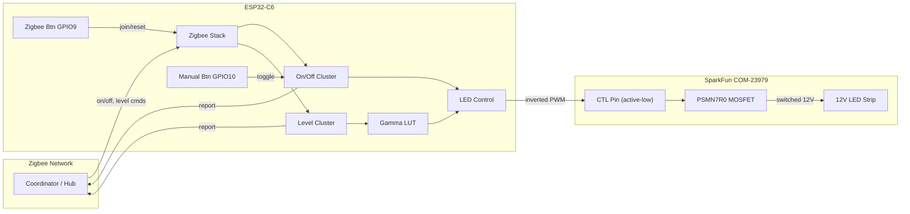

# Dimming Light Switch

Zigbee-enabled dimming light switch built on the ESP32-C6.

## 1. Overview

A Zigbee-enabled dimming light controller built on the **ESP32-C6** (RISC-V, IEEE 802.15.4 radio). It joins an existing Zigbee network as a **Router** and exposes itself as a **HA Dimmable Light** device. A coordinator/hub (e.g. Home Assistant with ZHA or Zigbee2MQTT) can turn the light on/off and set arbitrary brightness. Two physical buttons provide local control and network management. The LED strip is driven through a MOSFET switched by PWM with a **gamma-corrected** dimming curve.

State is **not** persisted across power cycles; the device starts at a default state (off, brightness = 254).

---

## 2. Hardware Design

### 2.1 Component List

- **ESP32-C6 module/devkit** -- Microcontroller with 802.15.4 radio
- **[SparkFun MOSFET Power Switch and Buck Regulator (Low-Side)](https://www.sparkfun.com/sparkfun-mosfet-power-switch-and-buck-regulator-low-side.html)** (SKU: COM-23979) -- Integrated PSMN7R0-100BS N-channel MOSFET (low-side, up to 10A) + LMR14203 buck regulator (3.3V/300mA output). Accepts 4.5-12V input via barrel jack, provides 3.3V regulated output and switched load output via poke-home connectors. **CTL pin is active-low** (pull LOW to turn load ON).
- **12V DC power supply** -- Barrel-jack center-positive (5.5x2.1mm), shared supply for LED strip and ESP32
- **12V non-addressable LED strip** -- Single-color (warm white, cool white, etc.)
- **2x tactile pushbuttons** -- Zigbee network button, manual on/off button
- **Capacitors** -- 100nF ceramic per button (optional hardware debounce)

### 2.2 GPIO Pin Assignments

All pins chosen to avoid strapping pins and USB pins on the ESP32-C6:

| GPIO | Function | Notes |
|------|----------|-------|
| 6 | PWM output to SparkFun board CTL pin | LEDC channel 0 |
| 9 | Zigbee network button | Active-low, internal pull-up; BOOT button on most devkits |
| 10 | Manual on/off toggle button | Active-low, internal pull-up |

### 2.3 Wiring: SparkFun COM-23979 Board

The SparkFun MOSFET Power Switch and Buck Regulator board is the central power component. It accepts 12V via its barrel jack, provides regulated 3.3V to the ESP32-C6, and switches the LED strip load via its low-side MOSFET.

```
                        SparkFun COM-23979
                    ┌─────────────────────────┐
 12V DC Supply ────►│ Barrel Jack (12V in)    │
                    │                         │
                    │ 1x4 Header:             │
                    │   VCC  ── (12V, unused) │
                    │   3.3V ─────────────────┼──► ESP32-C6 3V3 pin
                    │   CTL  ◄────────────────┼─── ESP32-C6 GPIO 6 (PWM)
                    │   GND  ─────────────────┼──► ESP32-C6 GND
                    │                         │
                    │ Poke-Home Load Output:  │
                    │   LOAD+ ────────────────┼──► LED Strip (+)
                    │   LOAD- ────────────────┼──► LED Strip (-)
                    └─────────────────────────┘
```

**Key points:**

- **Active-low control**: The CTL pin activates the load when pulled LOW. The PWM duty cycle must be **inverted** in software: `inverted_duty = max_duty - gamma_duty`. A 0% duty cycle (GPIO held LOW) means full brightness; 100% duty (GPIO held HIGH) means fully off.
- The 3.3V/300mA output from the onboard LMR14203 buck regulator powers the ESP32-C6 directly. Typical ESP32-C6 current draw with 802.15.4 radio active is ~80-130mA, well within the 300mA budget.
- The PSMN7R0-100BS MOSFET handles up to 10A (PCB-limited), sufficient for most 12V LED strips.
- The board includes a built-in flyback diode on the load side.
- Common ground is shared between ESP32, SparkFun board, and LED strip through the GND connection.

### 2.4 Button Circuits

Each button connects the GPIO pin to GND when pressed. The ESP32-C6 internal pull-up resistors are enabled in software. An optional 100nF capacitor from the GPIO pin to GND provides hardware debounce (software debounce is also implemented as a secondary measure).

```
3.3V ── [internal pull-up] ── GPIO ──┬── [100nF] ── GND
                                     │
                                  [Button]
                                     │
                                    GND
```

---

## 3. Software Architecture

### 3.1 ESP-IDF and Dependencies

- **Framework**: ESP-IDF v5.2 (configured in the dev container)
- **Zigbee SDK**: `esp-zigbee-lib` and `esp-zboss-lib` added via `idf_component.yml`
- **Target**: ESP32-C6 (set in `sdkconfig.defaults`)

New dependency file -- `main/idf_component.yml`:

```yaml
dependencies:
  espressif/esp-zigbee-lib: "~1.2.0"
  espressif/esp-zboss-lib: "~1.2.0"
```

### 3.2 Source File Structure

```
main/
  main.c                       -- app_main(), system init, task creation
  zigbee.c / zigbee.h          -- Zigbee stack init, endpoint/cluster setup, attribute callbacks
  led_control.c / led_control.h -- LEDC PWM init, gamma LUT, brightness API
  button.c / button.h          -- GPIO interrupt setup, debounce logic, event dispatch
```

`main/CMakeLists.txt`:

```cmake
idf_component_register(
    SRCS "main.c" "zigbee.c" "led_control.c" "button.c"
    INCLUDE_DIRS "."
)
```

### 3.3 Zigbee Device Model

The device registers as a **HA Dimmable Light** on **endpoint 10** with these server-side clusters:

| Cluster | ID | Purpose |
|---------|----|---------|
| Basic | 0x0000 | Manufacturer name, model identifier, power source |
| Identify | 0x0003 | Identify support (e.g. blink LED) |
| Groups | 0x0004 | Group membership |
| Scenes | 0x0005 | Scene storage |
| On/Off | 0x0006 | On/off attribute, toggled by Zigbee commands and local button |
| Level Control | 0x0008 | current_level (uint8, 0-254), controls PWM brightness |

Attribute write/command callbacks:

- **On/Off set**: calls `led_set_on_off(bool on)` which enables/disables PWM output at the last-set brightness.
- **Level Control move_to_level**: calls `led_set_brightness(uint8_t level)` which converts through the gamma LUT and sets the LEDC duty cycle.
- **Level Control with on/off variants**: handled identically, also updating the on/off attribute.

### 3.4 PWM / LED Control

| Parameter | Value |
|-----------|-------|
| Peripheral | LEDC (LED Control) |
| Timer | LEDC timer 0 |
| Resolution | 13-bit (8192 steps) |
| Frequency | 4 kHz |
| Channel | LEDC channel 0, GPIO 6 |

**Gamma correction lookup table**: A precomputed 255-entry table mapping Zigbee level values (1-254) to 13-bit PWM duty values. Generated with gamma = 2.2 and **inverted** for the active-low CTL pin on the SparkFun board:

```c
gamma_duty = (uint32_t)(pow((double)level / 254.0, 2.2) * 8191.0);
inverted_duty = 8191 - gamma_duty;  // Invert: LOW = on, HIGH = off
```

Level 0 maps to fully off (duty = 8191, i.e. CTL held HIGH). Level 254 maps to full brightness (duty = 0, i.e. CTL held LOW). The table ensures smooth perceived brightness transitions, especially at the low end.

**API**:

```c
void led_init(void);                       // Configure LEDC timer + channel
void led_set_brightness(uint8_t level);    // Apply gamma-corrected PWM (0-254)
void led_set_on_off(bool on);              // Enable/disable output, remembering last brightness
uint8_t led_get_brightness(void);          // Current level
bool led_get_on_off(void);                 // Current on/off state
```

### 3.5 Button Handling

Both buttons use GPIO interrupts (falling edge) with software debounce (50ms lockout via `esp_timer`).

**Zigbee network button (GPIO 9)**:

- **Short press (<3s)**: Invoke `esp_zb_bdb_start_top_level_commissioning(ESP_ZB_BDB_MODE_NETWORK_STEERING)` to join an available open network.
- **Long press (>=5s)**: Call `esp_zb_factory_reset()` to leave the network and clear Zigbee state, then restart steering.

**Manual on/off button (GPIO 10)**:

- **Short press**: Toggle the on/off state locally. Calls `led_set_on_off(!current_state)` and also updates the Zigbee On/Off cluster attribute so the hub stays in sync via reporting.

### 3.6 Zigbee Reporting

Configure the On/Off and Level Control attributes for **attribute reporting** so the coordinator is informed of local state changes:

- **On/Off**: report on change
- **Level**: report on change, min interval 1s, max interval 300s

### 3.7 Startup Sequence

```
app_main()
  ├─ Initialize NVS flash (required by Zigbee stack)
  ├─ led_init()         -- configure LEDC, set output to OFF, default brightness = 254
  ├─ button_init()      -- configure GPIO interrupts for both buttons
  ├─ zigbee_init()      -- create Zigbee endpoint, register clusters + callbacks
  ├─ esp_zb_start()     -- start the Zigbee stack (runs in its own task)
  └─ (FreeRTOS scheduler handles remaining tasks)
```

### 3.8 Task / Threading Model

- **Zigbee main loop**: Runs in the Zigbee task created by `esp_zb_start()`. All Zigbee callbacks execute in this context.
- **Button ISR**: Minimal -- sets a flag or posts to a FreeRTOS queue; actual handling (debounce timer, state changes) happens in a dedicated button task or via `esp_timer` callbacks on the main CPU.
- **LED control**: All LED functions are called synchronously from either the Zigbee callback context or the button handler. LEDC duty updates are thread-safe at the hardware level.

---

## 4. Zigbee Network Behavior

```
                     ┌───────────────────────┐
                     │   Zigbee Network      │
                     │                       │
  ┌──────────┐       │   ┌───────────────┐   │
  │  Hub /   │◄──────┼──►│  This Device  │   │
  │  Coord.  │       │   │  (Router)     │   │
  └──────────┘       │   └───────────────┘   │
                     │          ▲            │
                     │          │ relay      │
                     │   ┌──────┴────────┐   │
                     │   │ Other Devices │   │
                     │   └───────────────┘   │
                     └───────────────────────┘
```

- As a **Router**, this device is always powered and participates in mesh routing, extending network range.
- On first boot (or after factory reset), the user presses the Zigbee button to initiate **network steering**. The coordinator must have its permit-join window open.
- Once joined, the device is discoverable as a Zigbee HA Dimmable Light and can be controlled from the hub.
- Local button presses update both the hardware output and the Zigbee attributes, keeping the hub in sync.

---

## 5. sdkconfig Changes

Key Kconfig options to enable in `sdkconfig.defaults`:

```
CONFIG_IDF_TARGET="esp32c6"
CONFIG_ZB_ENABLED=y
CONFIG_ZB_RADIO_NATIVE=y
CONFIG_ZB_ZED_ROLE=n
CONFIG_ZB_ZCZR_ROLE=y
```

---

## 6. Data Flow


